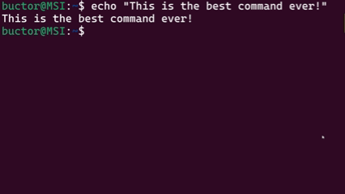

<h1 align="center">CLS</h1>

<h1 align="center">The cls command from windows command prompt for Linux</h2>

<p align="center">
  
</p>

## How to install it
### Git clone:
In the terminal: 
```
$ git clone https://github.com/Buct0r/cls.git && cd cls
```
then: 
```
$ cp cls /usr/local/bin
```

If it gives you an error like this:
```
cp: cannot create regular file '/usr/local/bin/cls': Permission denied
```
Just run the previous command with sudo:
```
$ sudo cp cls /usr/local/bin
```

In alternative you can clone the repo and add the directory to path
```
$ git clone https://github.com/Buct0r/cls.git
```
Edit your shell profile, depending on your system and shell:
```
$ vim ~/.bashrc
```
Add this line to the end of the file: 
```
export PATH=$PATH:~/cls
```
And then source the file
```
$ source ~/.bashrc
```
### Without git
Download the source code and use the same commands as above.

## Conclusion
If you decide to use the cls command, consider adding a star to the repo💫. I made this project mainly for fun and also because I'm pretty lazy and I prefferd to type less to clear the terminal output😓

Developed by Buct0r❤️